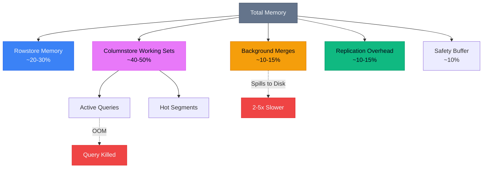
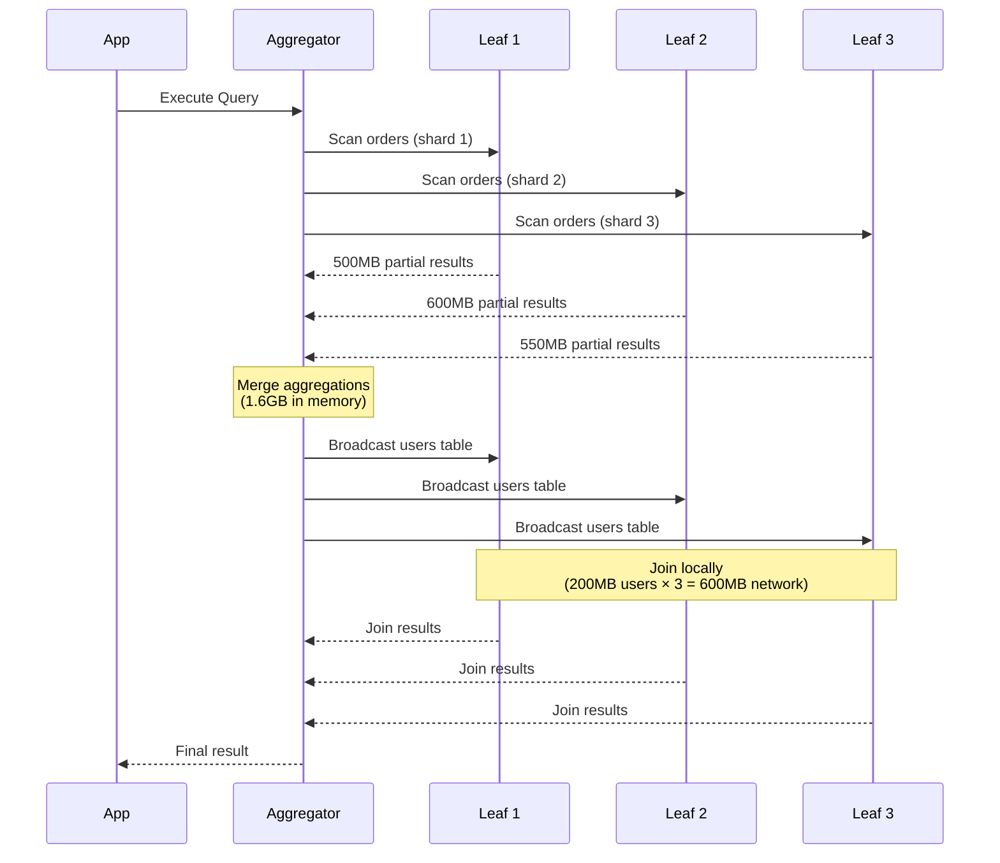
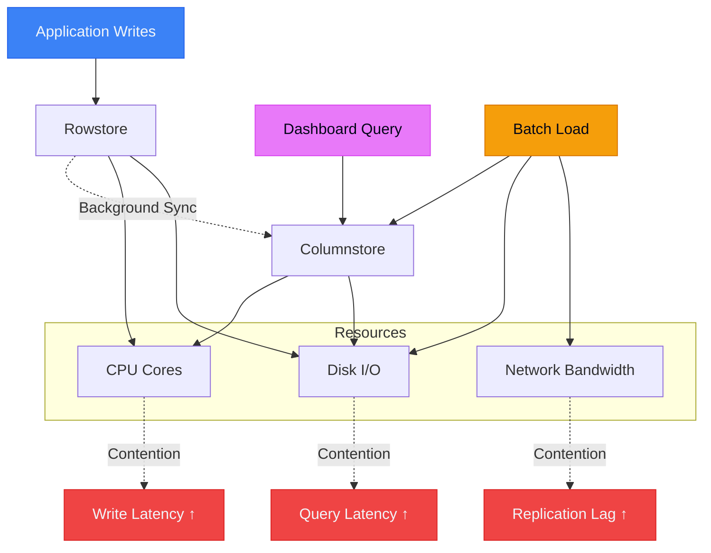
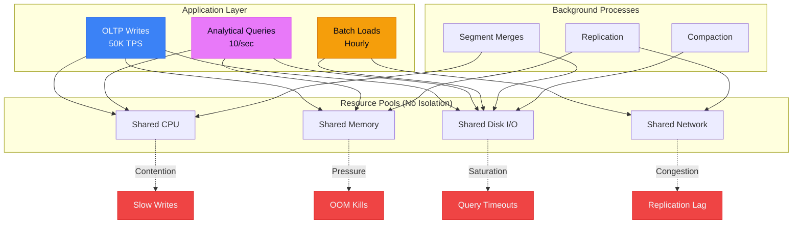

> [!NOTE]
> This post is Part 4 of the **[Distributed SQL Deep Dive](/blog/distributed-sql-series-overview)** series.

After two years supporting production SingleStore clusters—from 3-node dev environments to 40-node monsters processing 500K TPS—I've learned that most outages start with confident assumptions. This post covers the mistakes that hurt.

## TL;DR

- **Memory isn't optional**—it's the hard requirement that determines everything else
- **Query patterns matter more than hardware**—one bad JOIN reshuffles terabytes across your network
- **HTAP means shared resource contention**—analytics and OLTP fight for the same CPU/IO
- **Schema changes are deployment events**—not DBA tasks
- **High availability requires active-active**—passive standby is an expensive lie
- **Distributed systems fail sideways**—the symptom appears nowhere near the cause

If you're evaluating HTAP databases, this post explains what the vendor won't tell you.

---

## Memory: The Requirement Everyone Treats as an Optimization

This is the mistake that cost us the most money.

We sized our first production cluster based on **data size**. We had 2TB of active data, so we provisioned 3TB of storage with 128GB RAM per node. Math seemed fine.

**We were consistently OOM within 48 hours.**

### Why Memory Is Non-Negotiable

SingleStore (and most columnar stores) aren't like PostgreSQL. You can't just swap to disk when memory runs out. Here's what actually happens:



**The rowstore** (transactional data) needs memory for:

- Active transactions
- MVCC versioning
- Index pages
- Lock tables

**The columnstore** (analytical data) needs memory for:

- Segment decompression
- Hash table builds during aggregations
- Sort buffers
- Result sets

**Background merges** consolidate small segments into larger ones. If they run out of memory, they spill to disk. This is 2-5x slower and creates cascade failures during heavy write periods.

**Replication** doubles memory pressure because you're holding:

- Original data in memory
- Replicated data being written
- Replication log entries

### The Incident

**What happened:**

Our dashboard query ran every 5 minutes:

```sql
SELECT user_id, COUNT(*), SUM(amount)
FROM orders
WHERE created_at > NOW() - INTERVAL 1 HOUR
GROUP BY user_id;
```

Simple query. On PostgreSQL, this would be 100ms.

On SingleStore, during peak traffic:

- Query needs to decompress ~500MB of columnstore segments
- Build hash table for 2M unique users
- Aggregate across 8 leaf nodes
- Merge results on aggregator

**Memory required: ~12GB per query.**

We had 10 concurrent dashboards running this query.

**Result:** OOM kills, node restarts, cluster instability.

### What We Did Wrong

1. **Sized for data, not workload**
2. **Didn't account for query memory amplification**
3. **Ignored background process overhead**
4. **Ran OLTP and OLAP on the same memory pool**

### What We Should Have Done

**Memory sizing formula:**

```text
Total Memory = (Data * 0.3) + (Peak Query Concurrency * Max Query Memory) + (Write Buffer * 2) + 20% safety
```

For our workload:

- Data: 2TB
- Peak queries: 20
- Max query memory: 8GB
- Write buffer: 50GB

**Required:** 600GB + 160GB + 100GB + 150GB = ~1TB RAM

We had 384GB total (128GB × 3 nodes).

**We were off by 3x.**

---

## Query Patterns That Quietly Destroy Performance

The second-hardest lesson: **SingleStore's query planner doesn't save you from yourself.**

### The Distributed JOIN That Killed Us

```sql
-- Looks innocent
SELECT u.email, o.order_count, o.total_revenue
FROM users u
JOIN (
  SELECT user_id, COUNT(*) as order_count, SUM(amount) as total_revenue
  FROM orders
  WHERE created_at > '2025-01-01'
  GROUP BY user_id
) o ON u.user_id = o.user_id
WHERE u.status = 'active';
```

On a single-node database, this is fine.

On a distributed system:



**Total data movement:** 2.8GB

For a query that returns 50KB of results.

### What Went Wrong

The `users` table (200MB, rowstore) got broadcast to all leaf nodes because it wasn't sharded on `user_id`.

**The fix:**

```sql
-- Shard users table on user_id
ALTER TABLE users SHARD KEY (user_id);
```

After this change:

- No broadcast
- Co-located joins
- Network transfer: <1MB

**Query time:** 12 seconds → 200ms

### The Pattern

**Bad:** Join tables with mismatched shard keys  
**Good:** Co-locate data by the JOIN column

**Bad:** GROUP BY high-cardinality column (user_id)  
**Good:** Pre-aggregate or use columnar indexes

**Bad:** `SELECT *` in distributed queries  
**Good:** Explicit column selection

---

## Ingest + Analytics Contention (Or: Why Your Dashboard Killed Your API)

HTAP promises you can run analytics without hurting OLTP.

**This is true—until it isn't.**



### The Incident: Analytics Contention

**Context:**  
E-commerce platform. Black Friday. Peak traffic: 50K writes/sec.

**What we did:**  
Launched a real-time fraud dashboard powered by a complex analytical query that ran every 30 seconds.

**What happened:**

1. Dashboard query scans 500M rows
2. CPU spikes to 95% across all leaf nodes
3. Rowstore writes slow down (P99: 5ms → 50ms)
4. Application timeouts start
5. Connection pool exhausts
6. API unavailable

**Duration:** 22 minutes

### Root Cause

The fraud query was I/O bound, reading gigabytes of columnstore data.

This saturated disk I/O, causing:

- Rowstore writes to queue
- WAL fsync to slow down
- Transaction latency to spike

We had three workloads fighting for the same disk:

1. Transactional writes (critical)
2. Analytical scans (optional)
3. Background merges (necessary)

**There was no resource isolation.**

### The Fix

**Short term:**

- Moved dashboard to read replica
- Added query timeout (30s max)
- Implemented query queue limits

**Long term:**

- Separate OLTP and OLAP clusters
- Replicate data from OLTP to OLAP
- Accept seconds of lag for analytics

**Lesson:** HTAP works until your workloads spike simultaneously. Then you need separation.

---

## Schema Changes: The Operational Blind Spot

In PostgreSQL, `ALTER TABLE` is a DBA task.

In a distributed database, it's a **deployment event**.

### What We Learned

Adding a column to a 1TB table:

```sql
ALTER TABLE orders ADD COLUMN affiliate_id INT;
```

**Expected: Metadata update, instant**  
**Actual: 6-hour cluster lock, production outage**

### Why It Broke

1. **Rowstore compaction triggered**—rearranging rows for new column
2. **Columnstore segments rebuilt**—all 1TB re-encoded
3. **Replication backlog exploded**—every node replicating schema change
4. **Queries queued**—table locked during rebuild
5. **Connection pool exhausted**—timeouts cascaded

### The Pattern (Schema Changes: The Operational Blind Spot)

Schema changes in distributed systems:

- Touch every partition
- Require inter-node coordination
- Block concurrent writes
- Amplify network traffic

### What We Do Now

#### 1. Add columns as nullable

```sql
-- Bad: NOT NULL requires default value fill
ALTER TABLE orders ADD COLUMN status VARCHAR(20) NOT NULL DEFAULT 'pending';

-- Good: Nullable, backfill separately
ALTER TABLE orders ADD COLUMN status VARCHAR(20);
-- Backfill in batches, off-peak
UPDATE orders SET status = 'pending' WHERE status IS NULL LIMIT 100000;
```

#### 2. Test on read replica first

#### 3. Schedule during maintenance windows

#### 4. Monitor replication lag

#### 5. Have rollback plan

---

## High Availability: Myths vs Reality

**Myth:** "We have replication, so we're highly available."

**Reality:** Passive replicas are disaster recovery, not high availability.

### The Failure Mode Nobody Expects

**Setup:**

- 3-node cluster
- Synchronous replication
- "5 nines" SLA from vendor

**Incident:**

- Primary leaf node fails (disk corruption)
- Automatic failover to replica
- **Failover time: 45 seconds**

For a system doing 50K TPS, 45 seconds = **2.25 million failed requests**.

### Why Failover Is Slow

1. **Failure detection: 10-15 seconds**—heartbeat timeout
2. **Leader election: 5-10 seconds**—raft consensus
3. **State reconciliation: 10-15 seconds**—apply pending WAL
4. **Connection re-routing: 5-10 seconds**—clients reconnect

**This is optimistic.** In practice, we saw 60-90 second failovers.

### What Actually Works

**Active-active with client-side routing:**

```text
App → Load Balancer → [Node 1, Node 2, Node 3]
                       ↓        ↓        ↓
                     All nodes accept writes
```

**Trade-off:** More complex conflict resolution, but zero failover time.

**Our choice:** Accept passive replication, set client timeout to 60 seconds, implement retry logic.

---

## Distributed Systems Fail Sideways

The hardest debugging lesson: **the symptom appears nowhere near the cause.**


### Real Incident

**Alert:** "API response time P99 > 1 second"

**Investigation:**

1. Check API servers: Normal
2. Check database: Queries slow on Leaf 3
3. Check Leaf 3 metrics: Disk I/O saturation
4. Check what's hitting Leaf 3: Nothing unusual

**Root cause (found 2 hours later):**

Batch job on Leaf 1 caused replication lag → Leaf 3 caught up → disk I/O spiked → queries slowed.

**The alert happened on the application. The root cause was a batch job on a different node.**

### The Pattern: Distributed Failures

In distributed systems:

- Cause and effect are decoupled in time
- Cause and effect are decoupled in space
- Monitoring must be cluster-wide, not node-centric

### What We Monitor Now

Not just:

- CPU, memory, disk per node

But also:

- Replication lag between nodes
- Query latency by shard
- Network saturation between nodes
- Background process backlog
- Memory pressure trends (leading indicator)

---

## The Diagram I Wish I'd Drawn Earlier

This is the mental model that would have saved us months of pain:



**Key insight:** Everything shares everything. When one workload spikes, everything else suffers.

---

## What I'd Do Differently Next Time

### 1. Size for Memory, Not Data

Use this formula:

```text
Memory = (Active Data × 0.3) + (Query Working Sets × Concurrency) + 30% overhead
```

Don't cheap out. If the math says 512GB, provision 768GB.

### 2. Separate OLTP and OLAP Early

Don't wait for production pain.

**Start with:**

- OLTP cluster (rowstore-heavy, small nodes, many replicas)
- OLAP cluster (columnstore-heavy, large nodes, read replicas)
- Real-time replication between them

Accept seconds of lag for analytics.

### 3. Shard Keys Are Schema Decisions

Shard key is the most important schema choice. It determines:

- Query performance
- Data distribution
- Operational complexity

**Choose carefully. Changing it later requires full data migration.**

### 4. Treat Schema Changes as Deployments

Schema migration process:

1. Test on replica
2. Measure time and resource impact
3. Schedule maintenance window
4. Monitor replication lag
5. Have rollback plan

### 5. Monitor Leading Indicators

Don't wait for alerts. Watch:

- Memory pressure trends (before OOM)
- Replication lag growth (before divergence)
- Segment merge backlog (before compaction stall)

### 6. Load Test for Failure, Not Capacity

Don't just test "can it handle 100K TPS?"

Test:

- What happens when one workload spikes?
- What happens during failover?
- What happens when memory is 90% full?
- What happens during schema changes?

---

## Final Takeaway

Running distributed databases in production isn't about knowing the features.

It's about knowing the failure modes.

SingleStore is a powerful system. But power without understanding leads to expensive mistakes.

**The real lesson:** Respect the complexity. Test the assumptions. Monitor the second-order effects.

And always, always size for memory.

---

## Further Reading

- [SingleStore vs PostgreSQL: When Distributed SQL Actually Wins](/blog/singlestore-vs-postgresql)
- [How SingleStore Handles Real-Time Analytics at Scale](/blog/singlestore-real-time-analytics)
- [Debugging Slow Database Queries](/blog/debugging-slow-database-queries)

---

**Have your own production war stories?** I'd love to hear them. [Email me](mailto:connect2shahidmoosa@gmail.com) or connect on [LinkedIn](https://linkedin.com).
